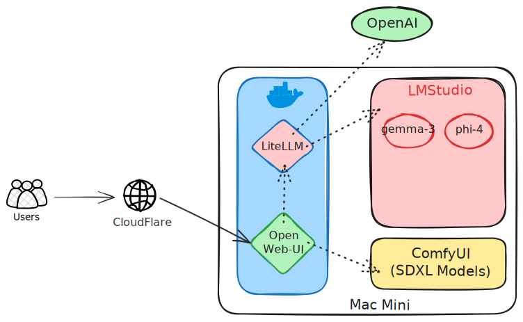

# Open WebUI with LiteLLM Setup

This project sets up an Open WebUI interface with LiteLLM as a backend proxy for [LM Studio](https://lmstudio.ai/), [Automatic 1111](https://github.com/AUTOMATIC1111/stable-diffusion-webui), and OpenAI Models. It uses Docker Compose to orchestrate the services.

## Prerequisites

- Docker and Docker Compose installed on your system
- API keys for the AI models (OpenAI, LM Studio) you want to use
- Automatic1111 and SDXL setup on your system (No advantage in running inside docker in Apple Silicon)
    ```bash
    ./webui.sh --listen --opt-split-attention-v1 --api
    ```
- Cloudflare Tunnel to Expose Internet Traffic

## Configuration



1. Create a `.env` file in the project root with the following content from `example.env`:

    ```yaml
    WEBUI_SECRET_KEY='admin-xxxxx'
    OPENAI_API_KEY='sk-xxxxx'
    LITELLM_MASTER_KEY='sk-xxxxx'
    LITELLM_SALT_KEY='sk-xxxxx'
    LITELLM_POSTGRES_PASSWORD='xxxxx'
    CHATGPT_API_KEY='xxxxx'
    LMSTUDIO_API_KEY='xxxxx'
    ```

    Replace `xxxxxx` with your actual API keys.

2. Ensure the `config.yaml` file is present in the project root. This file configures the available models for LiteLLM.

## Usage

1. Start the services:

    ```bash
    docker-compose up -d
    ```

2. Access the Open WebUI interface at `http://localhost:3000`
3. Access LiteLLM OpenAPI page at `http://localhost:4000`

## Available Models

The following models are configured in `config.yaml`:

-   [gpt-4.1-mini](https://platform.openai.com/docs/models/gpt-4.1-mini)
-   [mlabonne_gemma-3-4b-it-abliterated:Q4_K_S](https://huggingface.co/bartowski/mlabonne_gemma-3-4b-it-abliterated-GGUF)
-   [phi-4-abliterated](https://huggingface.co/mlx-community/phi-4-3bit)
